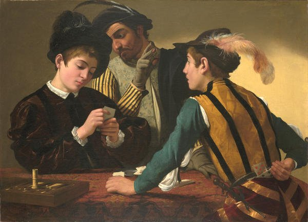
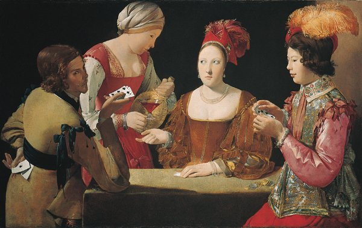

# 🃏 BBC Blackjack Web Version 🃏

Welcome to the **Web Version** of my Blackjack project for the BBC's Software Engineering tech test! This version builds upon the previous **console-based implementation** by introducing an interactive web interface using Flask, providing a playable experience via a web browser.

---

## 🚀 Key Enhancements in This Version

### 1. **Interactive Web Interface**

- **Flask Integration**: The game is now playable through a web browser, leveraging the Flask framework for routing and rendering.
- **Dynamic HTML Pages**: Instead of console output, players interact with y rendered HTML templates.

### 2. **Player-Friendly Design**

- **Minimalist Aesthetic**: The UI features:
  - A **white background** with clean, modern styling.
  - Black text for readability.
- **Custom Card Graphics**: The player’s and dealer’s cards are visually displayed in a clean, simple style (sourced from free APIs or local placeholders).

### 3. **Game Features Expanded**

- **Display of Player’s and Dealer’s Hands**: Cards and scores are dynamically updated on the browser interface.
- **Interactive Gameplay**:
  - Players can now click buttons to `Hit` or `Stand`.
  - The browser immediately updates the displayed game state.
- **Multiple Game States**:
  - `Game Over` Screen: Displays whether the player has won, lost, or tied.
  - Separate dealer and player phases, mimicking real Blackjack rules.

### 4. **Codebase Improvements**

- **Separation of Concerns**:
  - HTML templates (stored in a `templates` folder) are used to handle the UI.
  - Core game logic remains modular and testable within Python classes.
- **Readability and Scalability**: The project’s structure now separates backend logic, web application routes, and front-end templates for easier scalability and maintenance.

### 5. **Ease of Access**

- **Localhost Setup**: Players can launch the game locally with minimal setup, using the `Flask` development server.

---

## 🎮 How to Play

1. Clone the repository:

   ```bash
   git clone https://github.com/plinksie/BBC_Blackjack_WebVersion.git
   cd BBC_Blackjack_WebVersion

   ```

2. Set up a virtual environment and install dependencies: (Add the following to the terminal)
   python3 -m venv venv
   source venv/bin/activate
   pip install -r requirements.txt

3. Run the application:(Add the following to the terminal)
   python src/app.py

4. Open the game in your browser:
   • Navigate to http://127.0.0.1:5000.

5. Enjoy the interactive gameplay:
   • Click Start Game to begin.
   • Choose Hit to draw another card or Stand to end your turn.
   • See the results on the final Result page.

## 📖 The brief given for the task:

Blackjack, otherwise known as Twenty-One, Vingt-et-Un, or Pontoon, is a classic card game, approximately 250 years old. For your tech assessment, you will write code that can simulate a hand of blackjack. You may use any programming language or framework(s) you think appropriate. Alternatively, you may build on the provided starter code (in Python 3.)

The goal of the game is to get a hand of cards that’s worth as close to 21 points as possible. If a player’s hand goes over 21 points, they have lost.

The player is initially dealt two cards. They may then choose to ‘hit’ (draw a card) or ‘stand’ (stop drawing cards.) If they ‘hit’, then the new card’s value is added to the hand total. If this total exceeds 21, the player is ‘bust’, and loses.

Once all players have finished this process, the highest scoring hand wins.

Your solution should model a single deck of 52 cards:
Number cards are worth their face value (2-10)
Jacks, queens, and kings are worth 10 each
Aces are worth either 1 or 11 (player chooses)
The suit of the card does not matter.

✅ Fulfilled: The Deck class models a standard 52-card deck with correct ranks and suits. The Deck is properly initialized with all cards, shuffled, and allows cards to be dealt.
✅ Fulfilled: Your Deck class models a standard 52-card deck with correct ranks and suits. The Deck is properly initialized with all cards, shuffled, and allows cards to be dealt.
✅ Fulfilled: The calculate_score() method in the Hand class correctly checks if the hand total exceeds 21. This allows you to determine if the player is “bust.”
✅ Fulfilled: The current implementation provides all the mechanics needed to simulate a basic hand of blackjack.
✅ Fulfilled: The calculate_score() method automatically adjusts Ace values based on the total hand score, which mimics the player’s decision.

## Rules of Blackjack:

Welcome to Blackjack, the timeless card game of strategy and luck! Here’s how you can play my version of the game:

🃏 Rules of the Game

    1.	The goal is to get a hand as close to 21 points as possible without going over.
    2.	Each card has a point value:
    •	Number cards (2-10): Face value
    •	Face cards (Jack, Queen, King): 10 points each
    •	Ace: 1 or 11 points (whichever benefits the player)
    3.	You are initially dealt two cards.
    4.	Choose whether to:
    •	Hit: Draw another card to increase your hand total.
    •	Stand: Keep your current hand and end your turn.
    5.	If your hand exceeds 21 points, you’re bust, and you lose the round.

(Full description with gameplay variations can be found at https://en.wikipedia.org/wiki/Blackjack.)

<figure>
  
  <figcaption>The Cardsharps by Caravaggio (c.1594)</figcaption>
</figure>

## 📖 About

This program focuses on simulating key aspects of Blackjack, including:

- Creating and managing a deck of cards.
- Calculating the score of a Blackjack hand.
- Using modern Python development practices, such as object-oriented design and unit testing.

## 🃏 Features

- **52-card Deck**: Fully modeled with ranks and suits.
- **Shuffling**: Random deck order.
- **Card Dealing**: Simulates drawing cards from the top of the deck.
- **Blackjack Scoring**: Calculates hand scores with Ace handling.
- **TDD**: Fully tested with `unittest`.

---

## 🕹️ How to Play My Game

1. Start the Game:
   • Open a terminal in the project directory.
   • Run the game using: python3 src/blackjack.py

2. Gameplay:
   • You’ll be greeted with a message welcoming you to Blackjack!
   • The game will:
   • Deal two cards to the player and the dealer.
   • Display your initial hand and points.
   • Follow the on-screen prompts to either:
   • Type hit to draw another card.
   • Type stand to finish your turn.

3. Outcome:
   • The dealer will then play their hand according to standard rules:
   • The dealer must hit if their score is below 17.
   • The dealer must stand if their score is 17 or higher.
   • The game will compare scores and announce the winner:
   • Player wins if their score is closer to 21 than the dealer’s.
   • Dealer wins if their score is closer to 21 or the player goes bust.
   • It’s a tie if both scores are the same.

🏆 Features of the Game

• Interactive Gameplay: You can make real-time decisions with hit and stand.
• Winner Determination: The game automatically compares scores and announces the result.
• Aces Logic: Aces are handled dynamically as 1 or 11 points based on the player’s hand.

Good luck, and may the best hand win! ✨

<figure>
  
  <figcaption>Ace of Clubs by Georges de la Tour (c.1634)</figcaption>
</figure>

## 👋 About Me

Hi, I’m Paulina, and I’m thrilled to be applying for the BBC's Software Engineering Scheme! Here’s why I believe I would be a great fit:

- **Creative Problem-Solving**: My background includes architecture, design, and full-stack web development, equipping me with an ability to craft innovative, user-friendly solutions.
- **Team Collaboration**: I excel in collaborative environments, demonstrated by my experience leading and working within diverse teams, including at globally renowned organisations like SMC, Sandboxaq and Starbucks.
- **Passion for Technology and Storytelling**: As a fan of the BBC’s incredible storytelling and credibility, I’m inspired to bring technology and creativity together to enhance global user experiences.

### What I Loved About This Task

I particularly enjoyed how this task allowed me to explore **Object-Oriented Design** and **TDD principles** while creating something fun and interactive. It highlights the beauty of breaking problems down into smaller, testable components, a skill I look forward to applying on a larger scale at the BBC.

I’d be honored to contribute my creativity, technical skills, and passion for people-focused solutions to the BBC's digital innovations.

---

## 🚀 Future Enhancements

While this version has focused on creating a playable, minimalist experience, future enhancements could include:
• Support for multiple players.
• Custom rule variations (e.g., doubling down, splitting hands).
• Scalable hosting for deployment on platforms like Heroku or AWS.

Thank you for reviewing my submission!Looking forward to speaking with you in the next stage! 🎶
